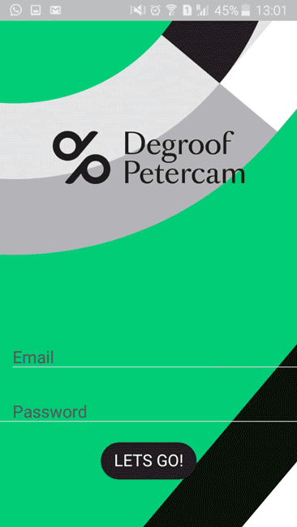

# Challenge Degroof Petercam 2018
- **Date prévue** : semaine du 24 au 28 septembre 2018
- **Deadline** : vendredi 28 remise via deploiement
- **Contexte** : Exercice de groupe réalisé durant notre formation en developpeur web au sein de [BeCode](https://github.com/becodeorg/)

## Description du projet
Le but principal du projet est d'analyser, concevoir et développer une application mobile pour Degroof Petercam.

 Celle-ci répond à un certain nombre d'objectifs:

- **Description** : Après la conception c'est le développement de l'application, ce dernier doit être en cohérence avec la conception.
- **Action de l'équipe** : En se basant sur l'environnement technique mis à leur disposition chaque équipe doit créer une application mobile fonctionnelle.

- **Expected output** : Une application mobile fonctionnelle répondant aux attentes des clients ( business ) et tournant soit sur un appareil android ou un simulateur.
- **Compétence** : Apprendre à s'adapter à un environnement technique ( outils, langages, ... ) non familier, apprendre à développer des applications mobiles.
- **Horizons** : S'ouvrir sur les différents environnements techniques et frameworks disponibles sur le marché, publier une application dans un store, différence entre app Android et iOs,...S'ouvrir sur le monde du mobile.
- **Os** : Linux(Ubuntu), Windows ou MacOs 

### Critères et évaluation :
#### Les critères d'acceptation : 
   - **éliminatoire** : une application doit être conforme aux besoins fonctionnelles initialement exprimés par nos clients
   - **non éliminatoire** : une application fonctionnelle

#### Evaluation :
- conformité de la réalisation par rapport à la conception
- fonctionnement de l'application ( boutons, écrans, ...)
- qualité du code
-  ergonomie de l'application (respect du thème, logo,...)

## Composition de l'équipe :
- [Charlotte Tusset](https://github.com/CharlotteTusset)
- [Massimo Regaglia](https://github.com/mregaglia)
- [Cedric Fournier](https://github.com/Cedric-Fournier)
- [Jesse Fumba](https://github.com/JFumba)

## Screenshots 

